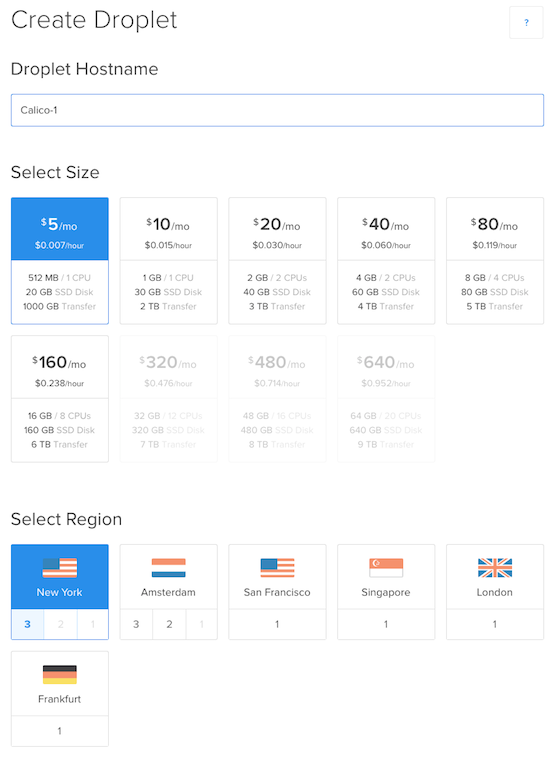
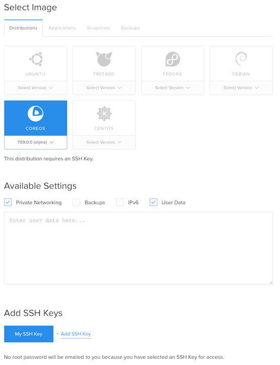

# Running calico-docker on DigitalOcean
Calico runs on the DigitalOcean virtualization platform.  The following instructions show how to network containers using Calico routing and the Calico security model on DigitalOcean.

## Getting Started
These instructions assume a total of two DigitalOcean hosts running CoreOS. For more general background, see the [CoreOS on DigitalOcean documentation](https://coreos.com/docs/running-coreos/cloud-providers/digitalocean/).

etcd needs to be running on the Calico hosts.  The easiest way to bootstrap etcd is with a discovery URL.  We'll use a cluster size of 1 for this demo.  For an actual deployment, choose an etcd cluster size that is equal to or less than the number of Calico nodes (an odd number in the range 3-9 works well).  For more details on etcd clusters, see the [CoreOS Cluster Discovery Documentation](https://coreos.com/docs/cluster-management/setup/cluster-discovery/).
Use `curl` to get a fresh discovery URL:
```
curl https://discovery.etcd.io/new?size=1
```
You need to grab a fresh URL each time you bootstrap a cluster.

Copy the following **cloud-config** contents into some local file or buffer to be used later. **Replace `<discovery URL>` with the URL retrieved above**:
```
#cloud-config
write_files:
  - path: /home/core/install-calico
    permissions: 0755
    owner: root
    content: |
      #!/bin/bash
      # Download calicoctl and make it executable:
      wget https://github.com/Metaswitch/calico-docker/releases/download/v0.4.6/calicoctl
      chmod +x ./calicoctl
      # Start the calico node service:
      sudo ./calicoctl node --ip=$private_ipv4
coreos:
  update:
    reboot-strategy: off
  etcd2:
    name: $private_ipv4
    discovery: <discovery URL>
    advertise-client-urls: http://$private_ipv4:2379
    initial-advertise-peer-urls: http://$private_ipv4:2380
    listen-client-urls: http://0.0.0.0:2379,http://0.0.0.0:4001
    listen-peer-urls: http://$private_ipv4:2380,http://$private_ipv4:7001
  units:
    - name: etcd2.service
      command: start
```
Keep this config handy, it will be used when creating the hosts.
Note: we disable CoreOS updates for this demo to avoid interrupting the instructions.

## Spinning up the VMs
From the DigitalOcean Web Console, select the "Create Droplet" button in the top right corner.  

In the form that appears, give the machine a hostname, select a desired size (the smallest size should be fine for this demo), and choose a region.  You should see something similar to the following:




Next, select CoreOS alpha version as the image type.  Note that some regions may not have this image as an option so you may have to reselect a region that supports CoreOS alpha version.
Check the Private Networking box and the User Data box under Available Settings.  Add your SSH public key to be able to log in to the instance without credentials.

You should now see something similar to the following:




Before selecting "Create Droplet", you will need to specify the User Data.  Paste the **cloud-config** you saved from the Getting Started section into the User Data text field.

Repeat the instance creation steps so that you have two Calico hosts.  Use the same cloud-config as the User Data for each host.

## Installing calicoctl on each node
SSH into each Calico host you created using the IP addresses found in the Droplets section of the Web Console:
```
ssh core@<ip>
```
On each node, there should be a script file called "install_calico" in the home directory.  Run the script on each node to set up Calico:
```
./install_calico
```
Then, on any one of the hosts, create the IP pool Calico will use for your containers:
```
./calicoctl pool add 192.168.0.0/16 --ipip --nat-outgoing
```

## Create a couple of containers and check connectivity
On the first host, run:
```
export DOCKER_HOST=localhost:2377
docker run -e CALICO_IP=192.168.1.1 -e CALICO_PROFILE=test --name container-1 -tid busybox
```
On the second host, run:
```
export DOCKER_HOST=localhost:2377
docker run -e CALICO_IP=192.168.1.2 -e CALICO_PROFILE=test --name container-2 -tid busybox
```
Then, run the following on the second host to see the that two containers are be able to ping each other:
```
docker exec container-2 ping -c 4 192.168.1.1
```
## Next steps
Now, you may wish to follow the [getting started instructions for creating workloads](https://github.com/Metaswitch/calico-docker/blob/master/docs/GettingStarted.md#creating-networked-endpoints).

## (Optional) Enabling traffic from the internet to containers
Services running on a Calico host's containers in DigitalOcean can be exposed to the internet.  Since the containers have IP addresses in the private IP range, traffic to the container must be routed using a NAT on the host and an appropriate Calico security profile.

Let's create a new security profile and look at the default rules.
```
./calicoctl profile add WEB
./calicoctl profile WEB rule show
```
You should see the following output.
```
Inbound rules:
   1 allow from tag WEB 
Outbound rules:
   1 allow
```

Notice that profiles define policy for inbound packets and outbound packets separately.  This profile allows inbound traffic from other endpoints with the tag `WEB`, and (implicitly) denies inbound traffic from all other addresses.  It allows all outbound traffic regardless of destination.

Let's modify this profile to make it more appropriate for a public webserver by allowing TCP traffic on ports 80 and 443:
```
./calicoctl profile WEB rule add inbound allow tcp to ports 80,443
./calicoctl profile WEB rule add inbound allow icmp type 8
```

Now, we can list the rules again and see the changes:
```
./calicoctl profile WEB rule show
```
should print
```
Inbound rules:
   1 allow from tag WEB 
   2 allow tcp to ports 80,443
Outbound rules:
   1 allow
```

After creating the WEB profile, run the following command on one of your DigitalOcean Calico hosts to create a Calico container running a basic NGINX http server:
```
docker run -e CALICO_IP=192.168.2.1 -e CALICO_PROFILE=WEB --name mynginx1 -P -d nginx
```

On the same host, create a NAT that forwards port 80 traffic to the new container.
```
iptables -A PREROUTING -t nat -i eth0 -p tcp --dport 80 -j DNAT  --to 192.168.2.1:80
```

You should now be able to access the NGINX http server using the public ip address of your DigitalOcean host on port 80 by using a browser to visit http://<host public ip> or running:
```
curl http://<host public ip>:80
```
